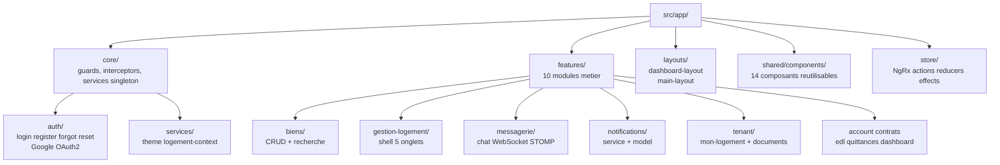
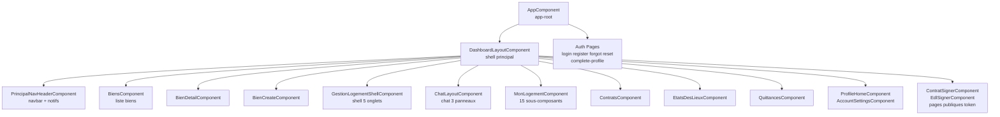
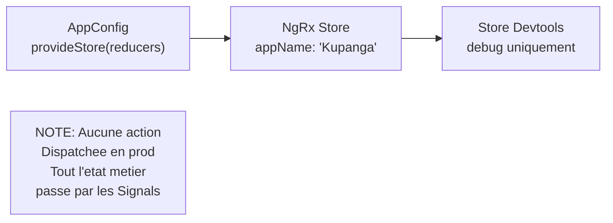
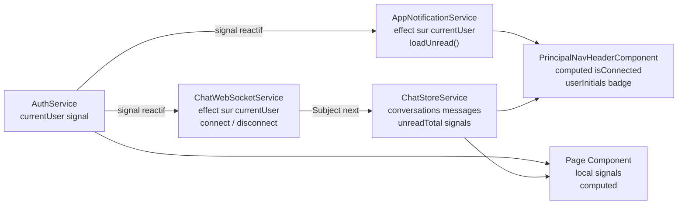
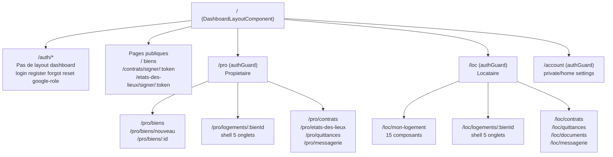
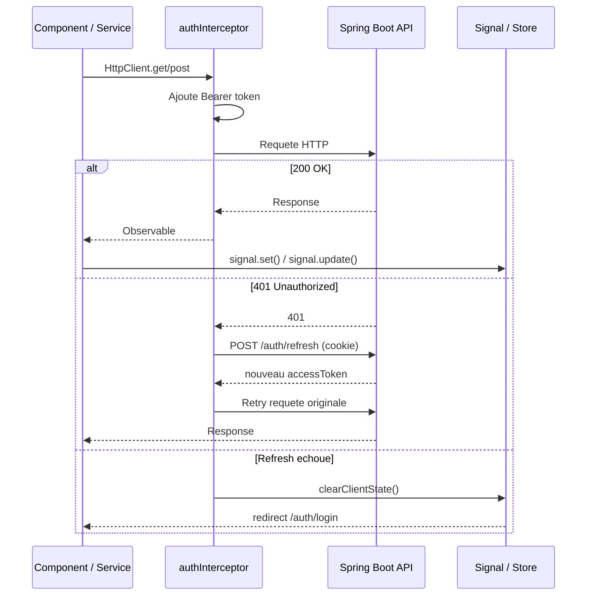
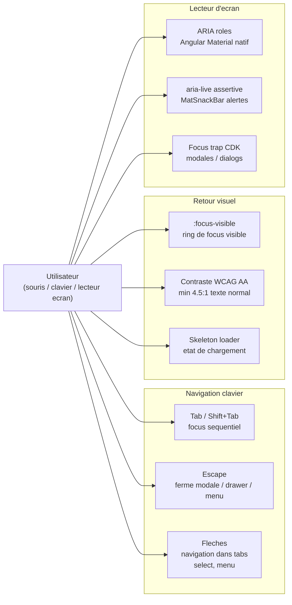
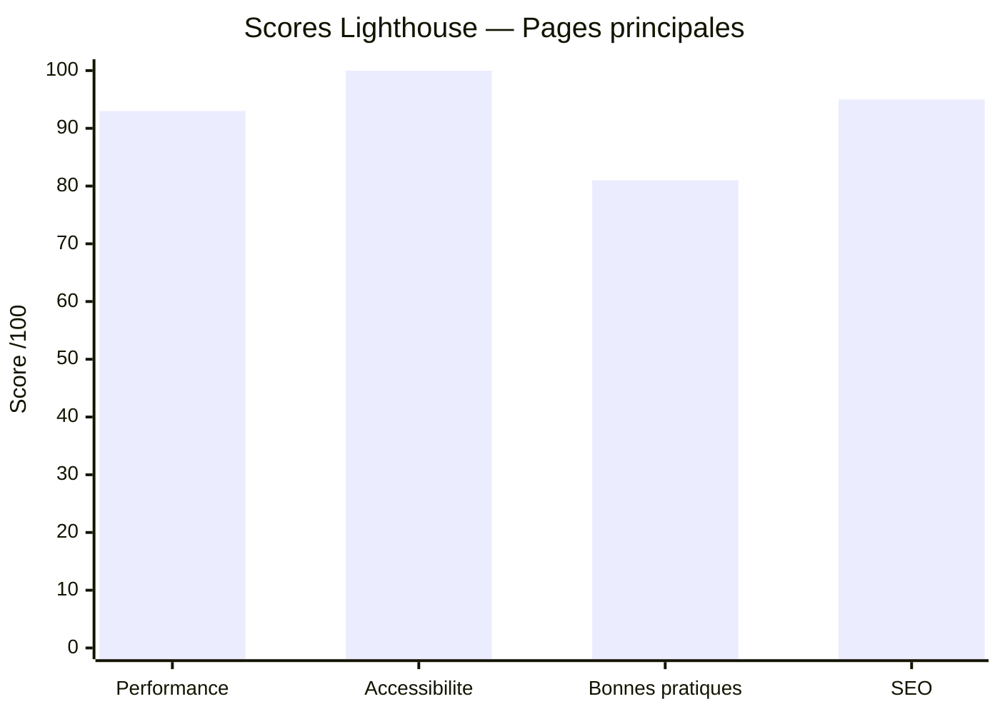

# Document d'Architecture Technique — Frontend Kupanga

> Version : 1.0 | Date : 2026-06-02 | Stack : Angular 20 / TypeScript 5.9

---

## Table des matieres

1. [Vue d'ensemble](#1-vue-densemble)
2. [Stack technique](#2-stack-technique)
3. [Structure du projet](#3-structure-du-projet)
4. [Architecture des composants](#4-architecture-des-composants)
5. [State Management (NgRx + Signals)](#5-state-management-ngrx--signals)
6. [Routing et Navigation](#6-routing-et-navigation)
7. [Couche HTTP et Integration API](#7-couche-http-et-integration-api)
8. [Formulaires](#8-formulaires)
9. [Communication inter-composants](#9-communication-inter-composants)
10. [Theming et Design System](#10-theming-et-design-system)
11. [Patterns et Conventions](#11-patterns-et-conventions)
12. [Accessibilite](#12-accessibilite)
13. [Qualité & Métriques Lighthouse](#13-qualité--métriques-lighthouse)

---

## 1. Vue d'ensemble

Kupanga Frontend est une SPA Angular 20 qui consomme l'API REST Kupanga (Spring Boot 3.2) et une connexion WebSocket STOMP pour la messagerie et les notifications en temps reel. Elle couvre deux espaces utilisateur distincts — Proprietaire (`/pro`) et Locataire (`/loc`) — plus un flux auth independant et des pages publiques de signature par token.

**Ce que l'application expose a l'utilisateur :**
- Catalogue et gestion de biens immobiliers (CRUD + recherche filtree)
- Workflow documentaire complet : contrats, etats des lieux, quittances avec signature electronique
- Messagerie temps reel proprietaire ↔ locataire (WebSocket STOMP)
- Notifications applicatives in-app (push WS + REST fallback)
- Deux themes Night/Light persistes en localStorage
- Connexion classique email/mdp et Google OAuth2 (flux front-initie)

---

## 2. Stack technique

| Technologie | Version | Usage |
|:---|:---|:---|
| Angular | 20.3.0 | Framework principal — standalone components uniquement |
| TypeScript | 5.9.2 | Langage — strict mode active |
| Angular Material | 20.2.14 | Composants UI — theming SCSS M2+M3 tokens |
| NgRx Store | 20.1.0 | Etat global (actuellement minimal — AppState) |
| NgRx Effects | 20.1.0 | Effets asynchrones (tableau vide a ce stade) |
| NgRx Store Devtools | 20.1.0 | Debug store (dev uniquement) |
| RxJS | 7.8.x | Flux HTTP, BehaviorSubject interceptor, interop Signals |
| @stomp/stompjs | 7.3.0 | Client WebSocket STOMP (messagerie + notifications) |
| sockjs-client | 1.6.1 | Transport fallback WebSocket |
| lucide-angular | 1.0.0 | Icones SVG — registered globalement dans appConfig |
| TailwindCSS | 3.4.4 | Classes utilitaires (usage limite — coexiste avec SCSS tokens) |
| zone.js | 0.15.0 | Change detection (non supprime) |
| Karma + Jasmine | 6.4 / 5.9 | Tests unitaires (couverture minimale — 1 spec) |
| Angular CLI | 20.3.8 | Build, serve, generate |

**API cibles (environment.ts) :**
- Dev : `http://localhost:8089`
- Prod : URL Render (definie dans `environment.prod.ts`)

---

## 3. Structure du projet

```
kupanga-front/
├── src/
│   ├── app/
│   │   ├── app.ts                         # Root component
│   │   ├── app.routes.ts                  # Routes declaratives
│   │   ├── app.config.ts                  # ApplicationConfig (providers)
│   │   ├── kupanga-theme.ts               # Fichier vide (PrimeNG supprime)
│   │   │
│   │   ├── core/                          # Services singleton, guards, interceptors
│   │   │   ├── auth/
│   │   │   │   ├── guards/auth.guard.ts
│   │   │   │   ├── interceptors/auth.interceptor.ts
│   │   │   │   ├── models/                # User, AuthResponse
│   │   │   │   ├── pages/                 # login, register, forgot, reset, complete-profile, logout
│   │   │   │   ├── services/auth.service.ts
│   │   │   │   └── shared/                # Atomes auth : auth-field, auth-layout-c, avatar, role-picker, steps
│   │   │   └── services/
│   │   │       ├── theme.service.ts
│   │   │       └── logement-context.service.ts
│   │   │
│   │   ├── features/
│   │   │   ├── account/private/           # profile-home, account-settings, profile-spaces-modal
│   │   │   ├── biens/                     # Liste, detail, create, edit, assign-tenant
│   │   │   ├── contrats/                  # Liste + page publique signer/:token
│   │   │   ├── dashboard/                 # Vue synthétique (placeholder)
│   │   │   ├── etats-des-lieux/           # Liste + page publique signer/:token
│   │   │   ├── gestion-logement/          # Shell 5 onglets (contrat/EDL/quittances/docs/resume)
│   │   │   ├── messagerie/                # Chat layout 3 panneaux (liste/vue/rail)
│   │   │   ├── notifications/             # Service + model (pas de composant dedie)
│   │   │   ├── quittances/               # Liste quittances
│   │   │   └── tenant/
│   │   │       ├── mon-logement/          # 15 sous-composants (hero, lease, KPIs, alertes...)
│   │   │       └── documents/             # loc-documents
│   │   │
│   │   ├── layouts/
│   │   │   ├── dashboard-layout/          # Shell principal (navbar + router-outlet)
│   │   │   └── main-layout/               # Layout secondaire (non utilise dans les routes actuelles)
│   │   │
│   │   ├── shared/
│   │   │   └── components/                # add-card, chips-group, dpe-badge, icon, opt-card,
│   │   │                                  # owner-mini, paper-preview, poi-chip, principal-nav-header,
│   │   │                                  # signature-pad, status-mini, tag-pill, wizard-stepper
│   │   │
│   │   └── store/
│   │       ├── actions/app.actions.ts     # initApp (seule action)
│   │       ├── app-state.ts               # AppState (appName: string)
│   │       ├── effects/index.ts           # Tableau vide []
│   │       └── reducers/index.ts          # Reducer trivial (appName)
│   │
│   ├── assets/
│   │   ├── avatars_profil/               # 18 avatars statiques (jpg/avif)
│   │   ├── logos/                        # kupanga-logo.svg
│   │   └── styles/core/                  # _palette.scss, _variables.scss
│   │
│   ├── environments/
│   │   ├── environment.ts                # dev : localhost:8089
│   │   └── environment.prod.ts           # prod : Render
│   │
│   └── styles/
│       ├── index.scss                    # Barrel global
│       ├── _tokens.scss                  # Variables SCSS + CSS custom properties (Night/Olive/Mint)
│       ├── _material-theme.scss          # Palettes M2 + overrides M3 tokens
│       ├── _dark-theme.scss              # Overrides dark
│       ├── _reset.scss                   # Reset minimal
│       ├── _typography.scss              # Classes utilitaires typo
│       └── _auth.scss                    # Styles specifiques auth
```

### Schema — Organisation des dossiers



---

## 4. Architecture des composants

### Principe Smart / Dumb

| Type | Caracteristique | Exemples |
|:---|:---|:---|
| **Smart (pages)** | Injecte services, gere l'etat local via signals, orchestre les appels HTTP | `BiensComponent`, `ChatLayoutComponent`, `MonLogementComponent`, `GestionLogementShellComponent` |
| **Dumb (UI)** | Recoit des `input()`, emet des `output()`, pas de service injecte | `BienCardComponent`, `BiensFilterBarComponent`, `ConversationListComponent`, `MessageInputComponent` |
| **Shell** | Wrapper route avec `<router-outlet>` ou tabs | `DashboardLayoutComponent`, `GestionLogementShellComponent` |

### Selecteurs — Convention

- Anciens composants : prefixe `app-` (non renommes)
- Nouveaux composants (messagerie, tenant, etc.) : prefixe `kp-` (ex: `kp-chat-layout`, `kp-chat-notification`)

### Hierarchie principale

**Feature biens :**
```
BiensComponent (smart)
  └─ BiensFilterBarComponent (dumb)
  └─ BienCardComponent (dumb) × N
  └─ BienCardSkeletonComponent (dumb) × N (chargement)

BienDetailComponent (smart)
BienCreateComponent (smart)
BienEditComponent (smart)
AssignTenantComponent (smart)
```

**Feature messagerie (3 panneaux) :**
```
ChatLayoutComponent (smart)
  └─ ConversationListComponent (semi-dumb)
  └─ ConversationViewComponent (semi-dumb)
       └─ MessageInputComponent (dumb)
  └─ ChatContextRailComponent (dumb)
ChatNotificationComponent (smart — affiche toast WS)
```

**Feature gestion-logement (shell 5 onglets) :**
```
GestionLogementShellComponent (smart)
  ├─ ContratLogementComponent
  │    └─ ContratNewComponent (formulaire)
  ├─ EdlLogementComponent
  │    └─ EdlNewComponent (formulaire)
  ├─ QuittancesLogementComponent
  │    └─ QuittanceNewComponent (formulaire)
  ├─ DocumentsLogementComponent
  └─ ResumeLogementComponent
```

**Feature tenant/mon-logement (15 composants) :**
```
MonLogementComponent (smart)
  ├─ HomeHeroComponent
  ├─ KpiStripComponent
  ├─ LeaseCardComponent
  ├─ OwnerCardComponent
  ├─ NextRentComponent
  ├─ QuickActionsComponent
  ├─ ReceiptListComponent
  ├─ DocListComponent
  ├─ AlertCardComponent
  ├─ ColocListComponent
  ├─ HealthCheckComponent
  ├─ IncidentListComponent
  ├─ MaintenanceCardComponent
  ├─ MeterCardComponent
  ├─ TimelineDeadlinesComponent
  └─ LogementAssignedDialogComponent
```

**Layout + navigation :**
```
DashboardLayoutComponent (shell)
  └─ PrincipalNavHeaderComponent (shared, smart)
       └─ [MatMenu] compte utilisateur
       └─ [Signal panel] notifications
  └─ ChatNotificationComponent
  └─ <router-outlet>
```

### Schema — Hierarchie des composants



### Schema — Composition logique des pages

Ce schema montre comment chaque page est construite par assemblage de couches de composants, du shell generique jusqu'aux atomes partages.

```mermaid
graph TD
    classDef shell   fill:#1E3545,stroke:#8FA464,color:#EFFBDB,stroke-width:2px
    classDef smart   fill:#2C4A5F,stroke:#8FA464,color:#EFFBDB,stroke-width:1px
    classDef dumb    fill:#172C3A,stroke:#5A8FAF,color:#EFFBDB,stroke-width:1px
    classDef shared  fill:#10212B,stroke:#E8B962,color:#EFFBDB,stroke-width:1px,stroke-dasharray:4

    Shell["DashboardLayoutComponent\nShell principal"]:::shell
    Nav["PrincipalNavHeaderComponent\nNavbar + compte + notifs + theme"]:::smart

    subgraph PageBiens["Page — Catalogue / Mes biens"]
        B0["BiensComponent (smart)\nfiltres viewMode pagination"]:::smart
        B1["BiensFilterBarComponent\nfiltres dumb"]:::dumb
        B2["BienCardComponent x N\naffichage carte"]:::dumb
        B3["BienCardSkeletonComponent\nloading state"]:::dumb
    end

    subgraph PageBienDetail["Page — Detail bien"]
        BD0["BienDetailComponent (smart)\nappel API getById"]:::smart
        BD1["OwnerMiniComponent\nproprietaire"]:::shared
        BD2["DpeBadgeComponent\nclasse energetique"]:::shared
        BD3["TagPillComponent\ntype / options"]:::shared
        BD4["PoiChipComponent\npoints interet"]:::shared
    end

    subgraph PageBienCreate["Page — Creer / Modifier un bien"]
        BC0["BienCreateComponent / BienEditComponent (smart)\nReactive Form 20 champs"]:::smart
        BC1["WizardStepperComponent\netapes visuelles"]:::shared
        BC2["SignaturePadComponent\n(non utilise ici)"]:::shared
    end

    subgraph PageGestLog["Page — Gestion logement (shell 5 onglets)"]
        GL0["GestionLogementShellComponent (smart)\nMat-tabs + GestionLogementService"]:::smart
        GL1["ContratLogementComponent\n+ ContratNewComponent (form)"]:::dumb
        GL2["EdlLogementComponent\n+ EdlNewComponent (form)"]:::dumb
        GL3["QuittancesLogementComponent\n+ QuittanceNewComponent (form)"]:::dumb
        GL4["DocumentsLogementComponent"]:::dumb
        GL5["ResumeLogementComponent"]:::dumb
        GL6["SignaturePadComponent"]:::shared
        GL7["StatusMiniComponent"]:::shared
    end

    subgraph PageChat["Page — Messagerie (3 panneaux)"]
        CH0["ChatLayoutComponent (smart)\nChatStoreService + ChatWebSocketService"]:::smart
        CH1["ConversationListComponent\nliste conversations"]:::dumb
        CH2["ConversationViewComponent\nhistorique messages"]:::dumb
        CH3["MessageInputComponent\nsaisie + envoi"]:::dumb
        CH4["ChatContextRailComponent\ncontexte bien"]:::dumb
        CH5["ChatNotificationComponent\ntoast WS entrant"]:::smart
    end

    subgraph PageMonLogement["Page — Mon logement (locataire)"]
        ML0["MonLogementComponent (smart)\nTenantHomeService + signals"]:::smart
        ML1["HomeHeroComponent\nphoto + adresse"]:::dumb
        ML2["KpiStripComponent\nloyer charges depot"]:::dumb
        ML3["LeaseCardComponent\ncontrat actif"]:::dumb
        ML4["OwnerCardComponent\ncontact proprietaire"]:::dumb
        ML5["NextRentComponent\nprochaine echeance"]:::dumb
        ML6["ReceiptListComponent\nquittances recentes"]:::dumb
        ML7["AlertCardComponent\nalerte statut"]:::dumb
        ML8["QuickActionsComponent\nactions rapides"]:::dumb
    end

    subgraph PageSign["Pages publiques — Signature (acces par token email)"]
        S0["ContratSignerComponent (smart)\ngetByToken + signerByToken"]:::smart
        S1["EdlSignerComponent (smart)\ngetByToken + signerByToken"]:::smart
        S2["SignaturePadComponent\ncanvas dessin signature"]:::shared
    end

    subgraph PageAuth["Pages Auth (hors DashboardLayout)"]
        A0["LoginComponent\nGoogle + email/mdp"]:::smart
        A1["RegisterComponent\nmulti-etapes + upload avatar"]:::smart
        A2["ForgotPasswordComponent"]:::smart
        A3["ResetPasswordComponent"]:::smart
        A4["CompleteProfileComponent\nchoix role Google"]:::smart
        A5["AuthLayoutCComponent\nmasthead editorial"]:::dumb
        A6["AuthFieldComponent\ninput atom"]:::dumb
        A7["RolePickerComponent\nchoix proprietaire/locataire"]:::dumb
        A8["PasswordStrengthComponent\njauge visuelle"]:::dumb
    end

    Shell --> Nav
    Shell --> PageBiens
    Shell --> PageBienDetail
    Shell --> PageBienCreate
    Shell --> PageGestLog
    Shell --> PageChat
    Shell --> PageMonLogement
    Shell --> PageSign

    B0 --> B1
    B0 --> B2
    B0 --> B3

    BD0 --> BD1
    BD0 --> BD2
    BD0 --> BD3
    BD0 --> BD4

    BC0 --> BC1

    GL0 --> GL1
    GL0 --> GL2
    GL0 --> GL3
    GL0 --> GL4
    GL0 --> GL5
    GL1 --> GL6
    GL1 --> GL7
    GL2 --> GL6

    CH0 --> CH1
    CH0 --> CH2
    CH0 --> CH3
    CH0 --> CH4
    CH0 --> CH5

    ML0 --> ML1
    ML0 --> ML2
    ML0 --> ML3
    ML0 --> ML4
    ML0 --> ML5
    ML0 --> ML6
    ML0 --> ML7
    ML0 --> ML8

    S0 --> S2
    S1 --> S2

    A1 --> A5
    A1 --> A6
    A1 --> A7
    A1 --> A8
    A0 --> A5
    A0 --> A6
```



**Legende :**
- Encadre orange (tirete) = composant partage (`shared/`)
- Encadre bleu = composant smart (injecte des services)
- Encadre gris fonce = composant dumb (inputs/outputs uniquement)

---

## 5. State Management (NgRx + Signals)

### NgRx Store — Usage actuel (minimal)

Le store NgRx est bootstrappe mais quasiment vide. Il sert de base pour une evolution future.

| Element | Contenu actuel |
|:---|:---|
| `AppState` | `{ appName: string }` |
| `reducers` | Un seul reducer trivial : retourne `'Kupanga'` sans modification |
| `effects` | Tableau vide `[]` — aucun effet enregistre |
| `actions` | Une seule action : `[App] Init App` (non dispatchee) |

**Conclusion : NgRx ne gere aucun etat metier a ce stade.** Tout l'etat applicatif reel est gere par Signals.

### Signals — Usage massif (etat reel)

Les Signals sont le mecanisme d'etat principal du projet. Chaque service singleton expose ses signaux comme API publique.

| Service | Signaux exposes | Role |
|:---|:---|:---|
| `AuthService` | `currentUser = signal<User \| null>` | Utilisateur connecte (source de verite) |
| `ThemeService` | `theme = signal<'light' \| 'dark'>` | Theme actif |
| `LogementContextService` | `logementBienId`, `hasLogement (computed)` | ID du bien actif pour navigation |
| `ChatStoreService` | `conversations`, `activeConversation`, `messages`, `unreadTotal`, `isLoadingMessages`, etc. | Etat complet du chat |
| `AppNotificationService` | `notifications`, `unreadCount (computed)` | Notifications in-app |
| `GestionLogementService` | `bien`, `contrat`, `loading`, `error`, `activeView`, `contratCount`, etc. | Etat du shell logement |
| `PrincipalNavHeaderComponent` | `drawerOpen`, `notifPanelOpen`, `isConnected (computed)`, `userInitials (computed)` | Etat UI navbar |
| `BiensComponent` | `filters`, `viewMode`, `isLoading`, `rawBiens`, `biens (computed)` | Etat local liste biens |
| `ChatLayoutComponent` | `selectedConv`, `directBienId`, `interlocuteurNom`, `bienContext` | Etat local chat |

### Interop Signals / RxJS

- `toSignal()` : utilise dans `DashboardLayoutComponent` pour convertir les `NavigationEnd` RxJS en signals
- `effect()` : utilise dans `ChatWebSocketService` pour reactiver la connexion STOMP quand `currentUser` change, et dans `AppNotificationService` pour charger les notifs au login
- `BehaviorSubject` : utilise uniquement dans `auth.interceptor.ts` pour le mecanisme de refresh token concurrent (besoin specifique de file d'attente RxJS)

### Schema — Flux NgRx (etat actuel)



### Schema — Usage des Signals (flux principal)



---

## 6. Routing et Navigation

### Principe

- Toutes les routes features utilisent `loadComponent` (lazy loading) ou `loadChildren`
- Un seul guard : `authGuard` (verifie la presence du `accessToken` en localStorage)
- Deux espaces proteges : `/pro` (proprietaire) et `/loc` (locataire)
- Pages publiques : `/` (catalogue), `/contrats/signer/:token`, `/etats-des-lieux/signer/:token`
- Auth hors `DashboardLayout` : `/auth/**` — pas de navbar

### Routes principales

| Chemin | Composant | Guard | Acces |
|:---|:---|:---|:---|
| `/auth/login` | `LoginComponent` | Non | Public |
| `/auth/register` | `RegisterComponent` | Non | Public |
| `/auth/forgot` | `ForgotPasswordComponent` | Non | Public |
| `/auth/reset-password` | `ResetPasswordComponent` | Non | Public |
| `/auth/google-role` | `CompleteProfileComponent` | Non | Post-login Google |
| `/` | `BiensComponent` | Non | Public (catalogue) |
| `/contrats/signer/:token` | `ContratSignerComponent` | Non | Public (lien email) |
| `/etats-des-lieux/signer/:token` | `EdlSignerComponent` | Non | Public (lien email) |
| `/pro` | `BiensComponent` | `authGuard` | Proprietaire |
| `/pro/biens` | `BiensComponent` | `authGuard` | Proprietaire |
| `/pro/biens/nouveau` | `BienCreateComponent` | `authGuard` | Proprietaire |
| `/pro/biens/:id` | `BienDetailComponent` | `authGuard` | Proprietaire |
| `/pro/biens/:id/modifier` | `BienEditComponent` | `authGuard` | Proprietaire |
| `/pro/biens/:id/assigner` | `AssignTenantComponent` | `authGuard` | Proprietaire |
| `/pro/logements/:bienId` | `GestionLogementShellComponent` | `authGuard` | Proprietaire |
| `/pro/contrats` | `ContratsComponent` | `authGuard` | Proprietaire |
| `/pro/etats-des-lieux` | `EtatsDesLieuxComponent` | `authGuard` | Proprietaire |
| `/pro/quittances` | `QuittancesComponent` | `authGuard` | Proprietaire |
| `/pro/messagerie` | `ChatLayoutComponent` | `authGuard` | Proprietaire |
| `/loc/mon-logement` | `MonLogementComponent` | `authGuard` | Locataire |
| `/loc/logements/:bienId` | `GestionLogementShellComponent` | `authGuard` | Locataire |
| `/loc/contrats` | `ContratsComponent` | `authGuard` | Locataire |
| `/loc/etats-des-lieux` | `EtatsDesLieuxComponent` | `authGuard` | Locataire |
| `/loc/quittances` | `QuittancesComponent` | `authGuard` | Locataire |
| `/loc/documents` | `LocDocumentsComponent` | `authGuard` | Locataire |
| `/loc/messagerie` | `ChatLayoutComponent` | `authGuard` | Locataire |
| `/account/private/home` | `ProfileHomeComponent` | `authGuard` | Les deux roles |
| `/account/settings` | `AccountSettingsComponent` | `authGuard` | Les deux roles |

### Schema — Arbre de routing



---

## 7. Couche HTTP et Integration API

### Services HTTP declares

| Service | Fichier | Endpoints consommes |
|:---|:---|:---|
| `AuthService` | `core/auth/services/auth.service.ts` | `POST /auth/login`, `/register`, `/logout`, `/refresh`, `/google`, `PATCH /auth/complete-profile`, `POST /auth/forgot-password`, `/reset-password`, `GET /auth/me` |
| `BienService` | `features/biens/services/bien.service.ts` | `POST /biens` (multipart), `POST /biens/search`, `GET /biens/:id`, `PATCH /biens/:id`, `GET /users/biens`, `POST /users/:id/recherche-locataire`, `POST /biens/:id/assigne-locataire/:userId` |
| `ContratService` | `features/gestion-logement/services/contrat.service.ts` | `POST /contrats/search`, `POST /contrats`, `POST /contrats/:id/signer-proprio`, `GET /contrats/signer/:token`, `POST /contrats/signer/:token` |
| `EdlService` | `features/gestion-logement/services/edl.service.ts` | `POST /etats-des-lieux/search`, `POST /etats-des-lieux`, `POST /etats-des-lieux/:id/signer-proprietaire`, `GET /etats-des-lieux/signer/:token`, `POST /etats-des-lieux/signer/:token` |
| `QuittanceService` | `features/gestion-logement/services/quittance.service.ts` | `GET /quittances/bien/:id`, `GET /quittances/mes-quittances`, `POST /quittances/search`, `POST /quittances`, `POST /quittances/:id/marquer-payee` |
| `ChatService` | `features/messagerie/services/chat.service.ts` | `POST /conversations/search`, `GET /historique?bienId&emailInterlocuteur`, `POST /messages/conversation/:email/lire`, `GET /messages/non-lus` |
| `AppNotificationService` | `features/notifications/services/app-notification.service.ts` | `GET /notifications`, `PATCH /notifications/:id/lire`, `PATCH /notifications/lire-toutes` |
| `LogementContextService` | `core/services/logement-context.service.ts` | `GET /users/biens` |

### Intercepteur HTTP

`authInterceptor` (fonctionnel, `HttpInterceptorFn`) :
1. Ajoute le header `Authorization: Bearer <token>` sur toutes les requetes (sauf `/auth/refresh` et `/register`)
2. Sur erreur 401 : tente un refresh du token via `POST /auth/refresh` (cookie HttpOnly)
3. Gere les requetes concurrentes pendant le refresh avec `BehaviorSubject` (file d'attente)
4. Sur echec du refresh : appel `authService.clearClientState()` → deconnexion propre

### WebSocket STOMP

`ChatWebSocketService` gere la connexion STOMP unique :
- Endpoint : `${apiUrl}/ws` via SockJS
- Reconnexion automatique : `reconnectDelay: 5000ms`
- Pre-connexion : refresh du token JWT avant chaque tentative
- Queues subscrites apres connexion :
  - `/user/${email}/queue/messages` et `/user/queue/messages` → chat
  - `/user/${email}/queue/notifications` et `/user/queue/notifications` → badge chat
  - `/user/${email}/queue/app-notifications` → notifications applicatives
- Deduplication par `seenIds: Set<number>` (plafond 1000 entrees)
- Destination publish : `/app/chat.send`

### Schema — Flux de donnees HTTP



---

## 8. Formulaires

Tous les formulaires utilisent **Reactive Forms** (`FormGroup` / `FormControl`). Pas de template-driven forms dans le projet.

### Formulaires identifies

| Composant | Champs principaux | Validators |
|:---|:---|:---|
| `LoginComponent` | `email`, `password` | `Validators.required`, `Validators.email` |
| `RegisterComponent` | `firstName`, `lastName`, `email`, `password`, `role`, `avatar` | `Validators.required`, custom password |
| `ForgotPasswordComponent` | `email` | `Validators.required`, `Validators.email` |
| `ResetPasswordComponent` | `newPassword`, `confirmPassword` | `Validators.required`, custom match |
| `CompleteProfileComponent` | `role` | `Validators.required` |
| `BienCreateComponent` | ~20 champs (titre, type, adresse, loyer, surface, etc.) | `Validators.required`, `Validators.min` |
| `BienEditComponent` | Meme structure que create (pre-remplie) | Meme validators |
| `ContratNewComponent` | `emailLocataire`, `dateDebut`, `dateFin`, `dureeBailMois`, `loyerMensuel`, `chargesMensuelles`, `depotGarantie` | `Validators.required`, `Validators.min` |
| `EdlNewComponent` | `typeEtat`, pieces + elements | `Validators.required` |
| `QuittanceNewComponent` | `periodeDe`, `periodeA`, `loyerMensuel`, `chargesMensuelles` | `Validators.required` |
| `AssignTenantComponent` | Recherche locataire (filtres `firstName`, `lastName`, `mail`) | Optionnels |

**Pattern notable :** `BienCreateComponent` utilise `FormData` multipart pour l'upload simultane du JSON `bienFormDTO` et des fichiers images. Le meme pattern est utilise dans `AuthService.register()`.

---

## 9. Communication inter-composants

| Mecanisme | Usage dans le projet |
|:---|:---|
| `input()` / `output()` | Composants dumb (BienCard, BiensFilterBar, ConversationList, MessageInput) |
| `inject(Service)` | Communication verticale — la majorite des composants smart injectent les services singletons |
| Signals (service partagé) | `ChatStoreService`, `AppNotificationService`, `LogementContextService`, `AuthService` — pattern "store local sans NgRx" |
| RxJS Subject | `ChatWebSocketService` expose `messages$`, `notifications$`, `appNotifications$`, `connected$` comme Observables froids |
| `toSignal()` | `DashboardLayoutComponent` convertit les evenements `NavigationEnd` en signals |
| `effect()` | `ChatWebSocketService` reagit a `currentUser()` signal ; `AppNotificationService` reagit a la connexion |
| `@HostListener` | `PrincipalNavHeaderComponent` ecoute `document:keydown.escape` et `document:click` |
| `MatDialog` | `ProfileSpacesModalComponent`, `LogementAssignedDialogComponent` |
| Router params | `ChatLayoutComponent` lit `bienId` et `interlocuteur` depuis `ActivatedRoute.queryParams` |
| `GestionLogementService` | Service non-root (`@Injectable()` sans `providedIn`) — scope au shell `GestionLogementShellComponent`, partage l'etat entre les 5 onglets sans NgRx |

---

## 10. Theming et Design System

### Identite visuelle — Palette Night / Olive / Mint

Le design system a evolue depuis les tokens declares dans `CLAUDE.md` (palette bleu `#1a56db`) vers une palette **Night / Olive / Mint** :

| Couleur | Variable SCSS | Valeur | Usage |
|:---|:---|:---|:---|
| Night (fond) | `$night` | `#10212B` | Fond principal dark |
| Night Mid | `$night-mid` | `#1E3545` | Surface card |
| Olive (primaire) | `$olive` | `#8FA464` | CTA, focus, liens actifs |
| Olive Light | `$olive-light` | `#B5CA8D` | Hover primaire |
| Mint (texte) | `$mint` | `#EFFBDB` | Texte principal dark |
| Amber (warning) | `$amber` | `#E8B962` | Alertes |
| Red (danger) | `$red` | `#E48173` | Erreurs |

### Tokens CSS custom properties

Definis dans `_tokens.scss` et utilises dans tous les composants :
- `--kp-primary`, `--kp-primary-hover`, `--kp-primary-subtle`, `--kp-primary-on`
- `--kp-bg`, `--kp-surface`, `--kp-surface-2`, `--kp-surface-3`
- `--kp-text-1` a `--kp-text-4` (echelle opacite Mint)
- `--kp-border`, `--kp-border-strong`
- `--kp-success`, `--kp-warning`, `--kp-danger`, `--kp-info` (+ variantes `subtle` et `text`)
- `--kp-font` (`DM Sans`), `--kp-font-display` (`DM Serif Display`), `--kp-font-mono` (`DM Mono`)

**Note :** Le `CLAUDE.md` mentionne `Inter` comme police principale, mais le code reel utilise `DM Sans` / `DM Serif Display` / `DM Mono`.

### Themes

| Classe body | Theme | Fond | Primaire |
|:---|:---|:---|:---|
| Aucune (defaut) | Night (sombre) | `#10212B` | `#8FA464` |
| `kp-theme-light` | Clair | `#EFFBDB` | `#6B7C4B` |
| `kp-theme-dark` | Night profond | `#0A1A22` | inchange |

Basculement gere par `ThemeService` : preference persistee dans `localStorage` (`kp_theme`), detection `prefers-color-scheme` au premier chargement.

### Angular Material — Configuration

- Palettes M2 definies dans `_material-theme.scss` : `$kupanga-primary` (olive-500), `$kupanga-accent` (bleu nuit), `$kupanga-warn` (danger rouge)
- Theme night : `mat.m2-define-dark-theme()`, Theme clair : `mat.m2-define-light-theme()`
- Tokens M3 (`--mat-sys-*`) lies aux `--kp-*` dans `:root` → cascade automatique light/dark
- Overrides granulaires : form fields (hauteur 44px, radius 10px, bottom-line supprimee), cards (border 0.5px, no shadow), dialogs, menus, tables, tabs, select, datepicker, snackbar, chips
- `mat-form-field-default-options : { appearance: 'fill' }` declare globalement dans `appConfig`

### Composants shared repertories

| Composant | Selecteur | Role |
|:---|:---|:---|
| `PrincipalNavHeaderComponent` | `app-principal-nav-header` | Navbar principale (smart — injecte 5 services) |
| `SignaturePadComponent` | n/d | Canvas de signature pour contrats/EDL |
| `WizardStepperComponent` | n/d | Stepper multi-etapes (creation bien) |
| `TagPillComponent` | `kp-tag-pill` | Badge categoriel |
| `StatusMiniComponent` | `kp-status-mini` | Pastille statut (contrat, EDL...) |
| `DpeBadgeComponent` | n/d | Badge classe energetique |
| `OwnerMiniComponent` | n/d | Mini-card proprietaire |
| `ChipsGroupComponent` | n/d | Groupe de chips filtres |
| `IconComponent` | n/d | Wrapper icone |
| `AddCardComponent` | n/d | Carte "Ajouter" vide |
| `OptCardComponent` | n/d | Carte option selectionnable |
| `PaperPreviewComponent` | n/d | Preview document PDF |
| `PoiChipComponent` | n/d | Chip point d'interet |

---

## 11. Patterns et Conventions

### Patterns detectes

| Pattern | Ou | Detail |
|:---|:---|:---|
| **Smart / Dumb** | Tout le projet | Pages smart + composants UI dumb — bien applique |
| **Service as Store** | `ChatStoreService`, `AppNotificationService`, `GestionLogementService` | Service injectable exposant des signals comme mini-store sans NgRx |
| **Signal-first** | Partout sauf intercepteur | `signal()` pour tout etat local, `computed()` pour les derives, `effect()` pour les reactions croisees |
| **toSignal()** | `DashboardLayoutComponent` | Interop RxJS → Signal pour les evenements router |
| **Functional interceptor** | `auth.interceptor.ts` | `HttpInterceptorFn` (Angular 17+ API) sans classe |
| **Functional guard** | `auth.guard.ts` | `CanActivateFn` (Angular 17+ API) |
| **loadComponent** | Toutes les routes | Lazy loading systematique par composant |
| **loadChildren** | `gestion-logement.routes.ts` | Sous-arbre de routes pour le shell logement |
| **FormData multipart** | `BienService.create()`, `AuthService.register()` | JSON blob + fichiers dans un seul POST |
| **Normalisation API** | `ChatService.normalizeConversationPage()` | Gere deux conventions de nommage API (fr/en) |
| **Retry on 401** | `auth.interceptor.ts` | Queue RxJS avec `BehaviorSubject` pour les requetes concurrentes |
| **Token deduplication** | `ChatWebSocketService.seenIds` | `Set<number>` pour eviter les doublons de messages WS |

---

## 12. Accessibilite

L'accessibilite a ete prise en compte a plusieurs niveaux dans la conception du frontend Kupanga.

### 12.1 Accessibilite des composants UI (Angular Material)

Tous les composants UI sont issus d'**Angular Material 20**, qui implemente nativement les specifications ARIA WAI-ARIA 1.2 :

| Composant Material | Support ARIA fourni |
|:---|:---|
| `mat-form-field` | `role="group"`, label associe via `aria-labelledby`, messages d'erreur via `aria-describedby` |
| `mat-dialog` | `role="dialog"`, `aria-modal="true"`, focus trap automatique a l'ouverture |
| `mat-menu` | `role="menu"`, navigation clavier fleches haut/bas, fermeture Echap |
| `mat-tab-group` | `role="tablist"` / `role="tab"` / `role="tabpanel"`, navigation clavier |
| `mat-select` | `role="combobox"`, annonce des options selectionnees aux lecteurs d'ecran |
| `mat-chip` | `role="option"` dans un `role="listbox"` |
| `mat-snack-bar` | `role="alert"` avec `aria-live="assertive"` — annonce immediate |
| Boutons / liens | `role="button"` natif, focus visible via `:focus-visible` |

### 12.2 Navigation au clavier

La navbar (`PrincipalNavHeaderComponent`) gere explicitement les interactions clavier :

```typescript
// Fermeture du drawer mobile et du panneau notifications via Echap
@HostListener('document:keydown.escape')
onEscape(): void {
  if (this.drawerOpen()) this.closeDrawer();
  if (this.notifPanelOpen()) this.notifPanelOpen.set(false);
}
```

- Tous les elements interactifs sont atteignables au clavier (`Tab` / `Shift+Tab`)
- Les menus Material se ferment sur `Escape` (comportement natif Angular Material)
- Le drawer mobile bloque le scroll du body (`document.body.style.overflow = 'hidden'`) pour eviter la navigation hors contexte

### 12.3 Contraste et lisibilite (WCAG AA)

La palette **Night / Olive / Mint** a ete construite avec le contraste comme contrainte :

| Paire | Rapport de contraste (approximatif) | Standard |
|:---|:---|:---|
| `$mint` (#EFFBDB) sur `$night` (#10212B) | ~12:1 | WCAG AAA |
| `$olive` (#8FA464) sur `$night` (#10212B) | ~5.8:1 | WCAG AA |
| `$mint-80` (80% opacite) sur `$night-mid` | ~8:1 | WCAG AAA |
| Texte danger `#D4856F` sur `#10212B` | ~5.1:1 | WCAG AA |
| Theme clair : `$night` (#10212B) sur `$mint` (#EFFBDB) | ~12:1 | WCAG AAA |

Les variantes `--kp-text-3` et `--kp-text-4` (opacites faibles) sont reservees aux labels secondaires et metadonnees — jamais pour du contenu informatif principal.

### 12.4 Structure semantique HTML

- Structure `<nav>`, `<main>`, `<header>` dans les layouts principaux
- Les icones Lucide sont des SVG inline — elles sont accompagnees d'un label textuel visible ou d'un `aria-label` dans les boutons icone-only (ex: bouton theme, bouton notifications)
- Les formulaires utilisent `<label>` explicites (pattern `.kp-label` + `mat-form-field`) — jamais de placeholder seul comme label
- Les listes de biens et conversations utilisent des balises `<ul>` / `<li>` semantiques

### 12.5 Gestion du focus

- `mat-dialog` piege le focus dans la modale (focus trap CDK) — l'utilisateur ne peut pas tabber hors de la boite de dialogue
- Apres fermeture d'une modale, Angular CDK restitue le focus a l'element declencheur
- Les pages de signature publique (`ContratSignerComponent`, `EdlSignerComponent`) positionnent le focus sur le premier champ interactif au chargement

### 12.6 Retours visuels et textuels

- Les etats de chargement sont indiques visuellement (`BienCardSkeletonComponent`) et non uniquement par l'absence de contenu
- Les erreurs de formulaire sont affichees sous chaque champ avec `mat-error` (texte, pas seulement couleur)
- Les notifications de succes/erreur passent par `MatSnackBar` (`role="alert"`) — compatible avec les lecteurs d'ecran
- Les badges de compteur non-lus (messagerie, notifications) incluent un texte accessible via `aria-label` dans la navbar

### Schema — Flux d'accessibilite cle


---

## 13. Qualité & Métriques Lighthouse

### Résultats mesurés

Des audits Lighthouse ont été réalisés sur les pages principales de l'application (route `/pro` et sous-routes). Les scores suivants représentent les moyennes observées :

| Catégorie        | Score     | Seuil cible |
| ---------------- | --------- | ----------- |
| Performance      | 93 / 100  | ≥ 70 ✅      |
| Accessibilité    | 100 / 100 | ≥ 90 ✅      |
| Bonnes pratiques | 81 / 100  | ≥ 90 ⚠️     |
| SEO              | 95 / 100  | ≥ 90 ✅      |

> Mesures effectuées en mode production simulé (Vite dev server avec throttling desktop), Lighthouse 13.x, Chrome 148.


### Schéma — Scores Lighthouse



### Ce qui a été mesuré

* **Pages auditées** : `/pro`, `/pro/biens`, principales pages du dashboard propriétaire
* **Conditions** : Desktop, réseau simulé, cache vidé entre chaque run
* **Outil** : Google Lighthouse 13.x via Chrome DevTools

### Points forts identifiés

* **Accessibilité parfaite (100)** : conformité ARIA, navigation clavier fonctionnelle, contrastes respectés et formulaires correctement labellisés
* **SEO élevé (95)** : structure sémantique cohérente, métadonnées présentes et contenu facilement indexable
* **Performance élevée (93)** : temps de chargement et métriques Core Web Vitals satisfaisants malgré la richesse fonctionnelle de l'application
* **Architecture Angular moderne** : lazy loading, standalone components et optimisation des bundles contribuent aux bons résultats globaux

### Axe d'amélioration principal

Le score **Bonnes pratiques (81)** reste inférieur à l'objectif cible de 90 et mérite une analyse complémentaire lors des prochains audits.

| Domaine                                          | Objectif          |
| ------------------------------------------------ | ----------------- |
| Bonnes pratiques Lighthouse                      | 81 → 90+          |
| Analyse détaillée des recommandations Lighthouse | À planifier       |
| Corrections des alertes restantes                | Backlog technique |

> Les performances globales de l'application sont déjà conformes aux objectifs qualité définis pour le projet. Les améliorations futures se concentreront principalement sur les recommandations Lighthouse relatives aux bonnes pratiques afin d'atteindre un niveau homogène supérieur à 90 sur l'ensemble des catégories.

---

